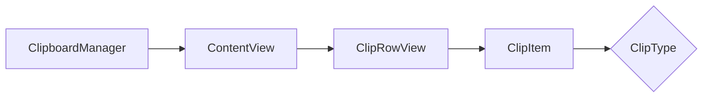

---

# 📝 Registro de Desenvolvimento — 2026-04-29

**Escopo:** Refatoração de UI e Modelagem de Dados
**Commits gerados:** 2
**Arquivos modificados:** 2

---

## 1. Visão Geral das Alterações

> A interface foi refatorada quebrando a estrutura gigante de ContentView, resolvendo problemas de tipo no compilador e criando um sistema visual de categorias para os itens salvos. O modelo `ClipItem` ganhou inteligência para deduzir e classificar o tipo do dado copiado (imagem, link, email, código) usando validações dinâmicas e regex.

---

## 2. Arquitetura Afetada

---

## 3. Mapa de Arquivos Modificados

| Arquivo | Tipo | O que mudou |
|--------|------|-------------|
| `monClips/ContentView.swift` | View | Extração do `ClipRowView`, adição de Preview de imagem, busca otimizada e Toast customizado. |
| `monClips/Item.swift` | Model | Implementado `ClipType` e a lógica de deteção do tipo de conteúdo em tempo real baseada em strings copiadas. |

---

## 4. Detalhamento por Commit

### `refactor(ui): extrai e aprimora componentes de listagem`

**Razão da alteração:**
> A ContentView estava extremamente inchada, o que estava estourando o tempo de inferência do compilador Swift. Além disso, a exibição precisava ser mais rica, fornecendo previews de URLs que fossem identificadas como imagens.

**O que faz agora:**
> Agora a renderização individual acontece no `ClipRowView`, onde as cores e ícones mudam dependendo do conteúdo copiado e as imagens carregam previews via URL remotamente. Temos também um "Toast" avisando que a cópia foi efetuada.

**Decisões técnicas:**
> Para resolver o bloqueio do compilador e melhorar a manutenção, a lógica condicional de tipo/ícones/cores foi movida para variáveis computadas na sub-view, e a checagem de paginação foi extraída para o método `checkPagination`.

**Arquivos envolvidos:**
- `monClips/ContentView.swift` — Refatoração total do body e extração de views.

### `feat(model): implementa categorização inteligente de dados`

**Razão da alteração:**
> A aplicação não tinha diferenciação visual sobre os textos copiados. Saber se é um trecho de código ou um e-mail copiado ajuda na localização visual para o usuário.

**O que faz agora:**
> A classe `ClipItem` deduz e expõe ativamente o seu "tipo" (`link`, `image`, `code`, `email`, `text`), usando as informações na string de texto que está dentro do registro no momento em que ela é consultada.

**Decisões técnicas:**
> Foi utilizado regex para os e-mails e análise de final e começo de strings para URLs/imagens. Para código, foi adotada uma heurística leve baseada em algumas chaves de linguagem (ex: var, let, func) para evitar parsing complexo no Model.

**Arquivos envolvidos:**
- `monClips/Item.swift` — Adição do enum `ClipType` e propriedade computada `type`.

---

## 5. ✅ O Que Está Funcionando

- Extração inteligente de tipos de área de transferência (links, código, imagens, e-mails).
- Preview de URL de Imagens dentro da View utilizando `AsyncImage`.
- Renderização otimizada sem estourar tempo limite do compilador Swift.
- Ações de deslizar (swipe actions) de Excluir e Fixar.
- Ações de Menu de contexto.
- Toast animado funcionando na cópia.

---

## 6. ❌ O Que Está Pendente

- [ ] Melhorias heurísticas em detecção de código (atualmente focado bastante em Swift/JS/Linguagens C-Like).

---

## 7. ⚠️ Dívida Técnica Identificada

- Como o `type` do modelo é uma variável computada que realiza checagens Regex pesadas toda vez que é lida, se o usuário listar centenas de recortes, pode haver lentidão ao fazer scroll. O ideal seria processar isso apenas uma vez no init e salvar no banco de dados (`@Model`).
- Na ContentView.swift há uma checagem de loop com Timer no `.onAppear` e outro `.onChange(of: scenePhase)`. Podem ser consolidados.

---

## 8. Padrões Importantes a Lembrar

- Views muito aninhadas devem obrigatoriamente ter seus modificadores lógicos como paginação e afins extraídos para métodos (`private func`) ou serem quebrados em `SubViews` menores para preservar a inferência do compilador em tempo de `build`.

---

## 9. Próximos Passos

1. Alterar o Model para que o campo de tipo seja definido no `init()` e salvo na estrutura, evitando o reprocessamento de regex de dezenas de itens simultaneamente na View.
2. Organizar o repositório quebrando Model, Views, e ViewModels em arquivos separados em vez de agrupar Views no mesmo arquivo.

---

## 10. Validações Mapeadas

| Campo / Função | Regra de validação | Status |
|---------------|-------------------|--------|
| regex email | Validar Regex contra padrão | ✅ |
| renderização imagens | Apenas exibir se tipo == image e URL válida | ✅ |

---